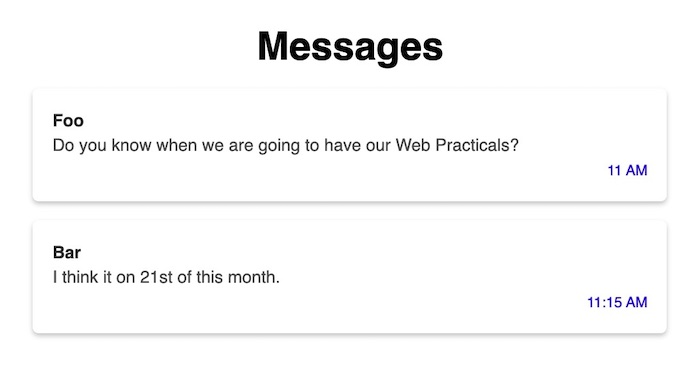

# Missing message time

If you open the [index.html](index.html), you will see that there are two messages.

If you notice properly, then the time that message was sent is displayed in the first
message to the bottom left of the message box.
But it is missing in the second message.

## Tasks

Perform following tasks:

- Add time `11:15 AM` to the second message. Identify the correct location to add the new tag along with the correct class attribute.
- Move the time to the right side of the message box. Identify the correct location to add the CSS property.
- Give the box shadow to message box to make it more attractive. (Hint: `box-shadow: 0 2px 4px rgba(0, 0, 0, 0.2);`)
- See removing `border` of the message box make box beautiful or not.

## Expected Output

## Required Knowledge

- Use of `` tag
- CSS `text-align` property

## Starter code

- [index.html](index.html)

__NOTE:__ Internal CSS is used using `style` tag for convenience here.
