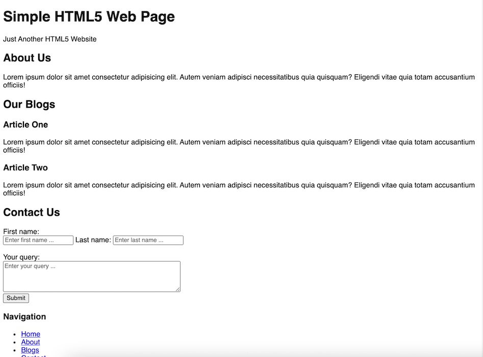
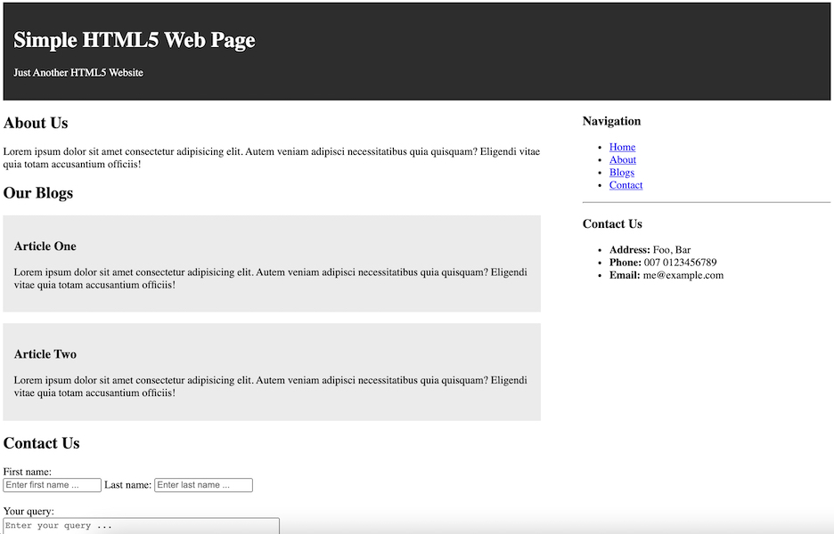

# Make page semantic

If you open the [index.html](index.html), you will find that few empty CSS selectors
and html tag like `div` with `id`.

The page looks like below at the moment:

## Tasks

- Update the empty CSS selectors as per the instructions given.
- Change the `div` with `id` to its semantic names like `header`, `main`, `section` or `article`.

## Expected Output

### Code Inspection

- See what happen when you remove `

` line. Try to understand what it happens.
- Cut the code snippet of _sidebar_ `div` or `aside` and paste before `div` or `main` with id _main_ and notice what happens.

## Required Knowledge

- Use of `color`, `line-height`, `text-align` and other common CSS properties
- [CSS float](https://www.w3schools.com/css/css_float.asp)
- [Semantic Tags](https://www.w3schools.com/html/html5_semantic_elements.asp)

## Starter code

- [index.html](index.html)

__NOTE:__ Internal CSS is used using `style` tag for convenience here.
